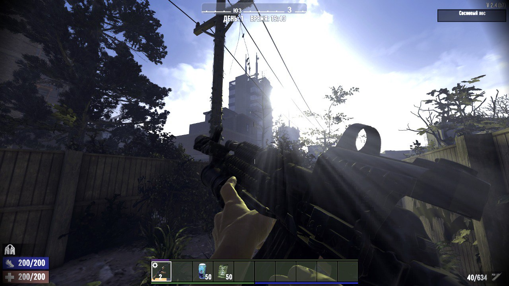
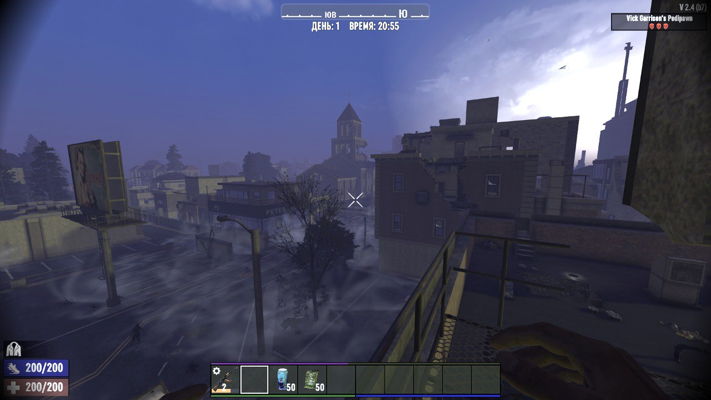
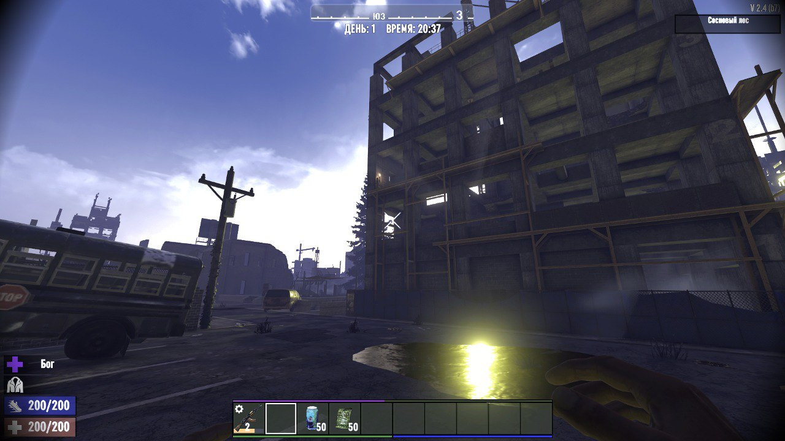
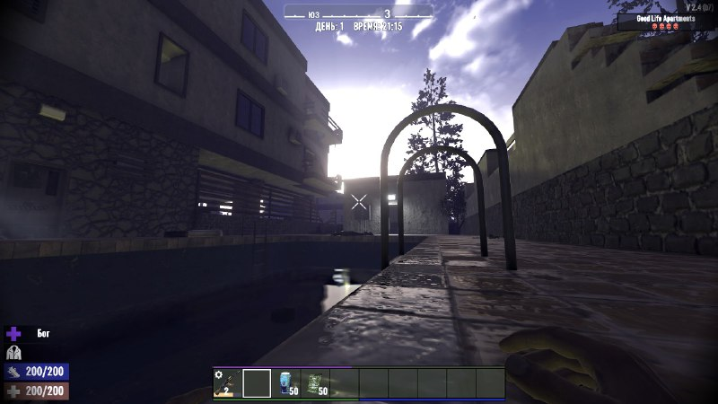
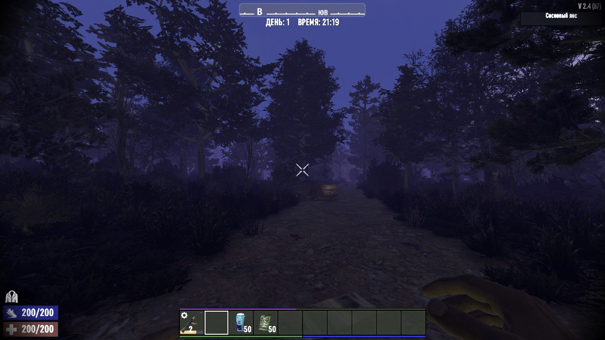
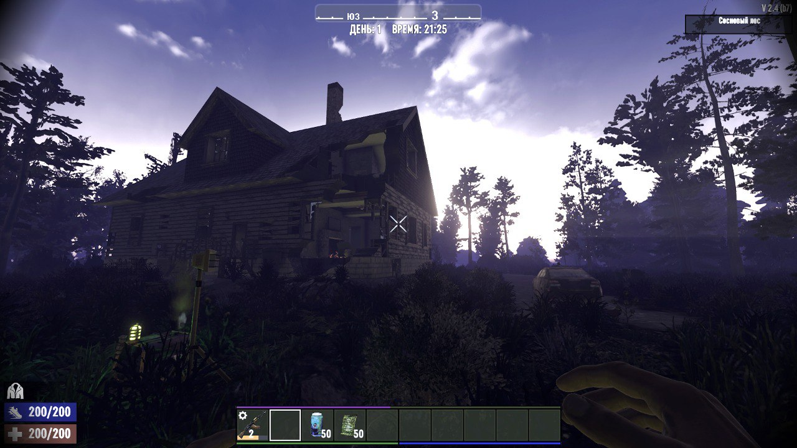

# EscapeFromNavezgane-7-Days-To-Die-mods-collection-

!!! MANUAL INSTALLATION!!! Building mods to deepen the game's atmosphere and preserve its original concept, please make sure to read the readme

==== DOWNLOAD / УСТАНОВИТЬ (GoogleDrive) - https://drive.google.com/file/d/1t-Q53IqXzXkBEVNMHezlN9ZvmfXEVaaJ/view?usp=drive_link ====

!Scroll down to English localization!
ГАЙД ПО УСТАНОВКЕ СБОРКИ

АВТОРСКИЕ ПРАВА  
Все модификации, входящие в состав сборки, являются собственностью их оригинальных авторов. Я не являюсь разработчиком ни одного из используемых модов. Моя роль ограничивается отбором,
тестированием, совмещением и настройкой существующих проектов для создания целостного игрового опыта.  
Если вам понравился какой-либо мод, настоятельно рекомендуется найти его оригинальную страницу (на 7DTD Mod Launcher, GitHub, Reddit или других платформах) и, при возможности, 
поддержать автора отзывом, звёздочкой или донатом. Уважение к труду создателей — основа здорового моддинг-сообщества.

Версия игры: A21.4 (2.4)  
Сборка предназначена для мощных компьютеров. На слабых конфигурациях возможны просадки FPS, зависания и нестабильная работа.

СОЗДАНИЕ МИРА  
При создании нового мира рекомендуется выбирать карту Pregek8K или генерировать случайный мир размером 8192–10240 блоков. Это обеспечит появление крупных городов, 
на которые сделан визуальный акцент с помощью модификаций.

=== УСТАНОВКА МОДОВ ===
1. Перейдите в корневую папку игры (где расположен файл 7DaysToDie.exe).  
2. Найдите или создайте папку Mods.  
3. Скопируйте всё содержимое папки Mods из архива сборки в эту папку.  
На этом установка модов завершена.

=== УСТАНОВКА ШЕЙДЕРОВ === 
1. Запустите программу-установщик из папки Shaders.  
2. Если путь к игре не определился автоматически, укажите его вручную (папка с 7DaysToDie.exe).  
3. Выберите версию DirectX 11 или 12 и завершите установку, нажимая «Далее».  
4. Все дополнительные файлы из папки Shaders (пресеты и прочее) переместите в папку, куда была установлена программа шейдеров.

После запуска игры нажмите клавишу Home, чтобы открыть меню шейдеров. Выберите нужный пресет с помощью стрелок в левом верхнем углу и при необходимости настройте параметры: гамму, виньетку и другие.

=== ЗАМЕНА МУЗЫКИ (ПО ЖЕЛАНИЮ) ===  
Музыкальное сопровождение можно заменить вручную. Файлы находятся в следующих подпапках:  
- CombatMusic — музыка во время боя  
- ExplorationMusic — музыка при исследовании мира  
- HomeDay / HomeNight — музыка на базе игрока в дневное и ночное время (требуется установленная кровать)  
- SuspenseMusic — вероятно, активируется при низком уровне здоровья  
- TraderMusic — музыка у торговца  

Путь: Mods/CustomExplorationMusicMod/Resources  
Рекомендуемые форматы: .mp3 или .wav  
Дополнительные настройки доступны в файле config.json.

=== ИЗВЕСТНЫЕ ПРОБЛЕМЫ ===  
- Мод ZCustomAvatars несовместим со сборкой.  
- Возможна бесконечная активация морфина и других шприцов путём отмены анимации.  
- При быстром переключении на пулемёты во время бега может нарушаться прицеливание.  
- Музыкальные композиции иногда обрываются до завершения.

=== ПЛАНЫ ПО РАЗВИТИЮ СБОРКИ ===  
Сборка будет регулярно обновляться. В неё будут добавляться совместимые модификации, расширяющие или улучшающие игровой процесс. 
Все новые версии останутся бесплатными и будут распространяться в том же формате — через архивы с ручной установкой.  
Если вы обнаружите ошибки, недочёты или нестабильное поведение — пожалуйста, сообщайте об этом.

=== ПРОЧЕЕ ===  
Сборка протестирована в течение более чем 40 часов игры — вылетов зафиксировано не было. Вы можете свободно экспериментировать с составом: добавлять или удалять моды по своему усмотрению.  
В случае вопросов или необходимости обратной связи пишите на: maksimus555ver@gmail.com

|==ENGLISH==|

=== COPYRIGHT NOTICE ===  
All mods included in this pack are the intellectual property of their respective original authors. I am not the creator of any of these modifications. 
My role is limited to selection, testing, integration, and configuration of existing community-made content to deliver a cohesive gameplay experience.  
If you enjoy a particular mod, please locate its original source 
(typically on 7DTD Mod Launcher, GitHub, Reddit, or the author’s personal page) and consider supporting the developer through feedback, ratings, or donations if available. 
Respecting creators’ work is essential to maintaining a healthy modding community.

=== INSTALLATION GUIDE FOR THE MODPACK ===

Game Version: A21.4 (2.4)
This modpack is intended for high-end systems. On lower-end hardware, performance issues such as FPS drops, stuttering, or instability may occur.

=== WORLD GENERATION===   
When creating a new world, it is recommended to use the Pregek8K map or generate a random world with a size of 8192–10240 blocks. 
This ensures the appearance of large cities, which are visually enhanced by included mods.

=== MOD INSTALLATION ===  
1. Navigate to the game’s root directory (where the file 7DaysToDie.exe is located).  
2. Locate or create a folder named Mods.  
3. Copy all contents from the Mods folder in this archive into the game’s Mods folder.  
Mod installation is now complete.

=== SHADER INSTALLATION ===  
1. Run the installer provided in the Shaders folder.  
2. If the game path is not detected automatically, specify it manually (the folder containing 7DaysToDie.exe).  
3. Select DirectX 11 or 12 and proceed through the installation by clicking “Next” until completion.  
4. Copy all additional files from the Shaders folder (presets, textures, etc.) into the directory where the shader program was installed.

After launching the game, press the Home key to open the shader menu. Use the arrows in the top-left corner to select a preset, then adjust settings such as gamma, vignette, 
and other parameters as needed.

=== CUSTOM MUSIC REPLACEMENT (OPTIONAL) ===  
You may replace the in-game music tracks manually. The audio files are organized as follows:  
- CombatMusic – plays during combat  
- ExplorationMusic – plays while exploring the world  
- HomeDay / HomeNight – plays at the player’s base during day/night (a bed must be placed to define the base)  
- SuspenseMusic – likely triggers when health is critically low  
- TraderMusic – plays when interacting with traders  

Path: Mods/CustomExplorationMusicMod/Resources  
Supported formats: .mp3 or .wav  
Advanced settings can be adjusted in the config.json file.

=== KNOWN ISSUES ===  
- The mod ZCustomAvatars is incompatible with this pack.  
- Morphine and other injectable items can be used infinitely by canceling the animation.  
- Rapid weapon switching to machine guns while sprinting may break aiming.  
- Music tracks sometimes cut off before finishing.

=== FUTURE UPDATES ===   
This modpack will be updated regularly. New compatible mods that expand or improve gameplay mechanics will be added over time. 
All future versions will remain free and distributed in the same format—via manual-install archives.  
If you encounter bugs, inconsistencies, or stability issues, please report them.

=== ADDITIONAL NOTES ===  
The pack has been tested for over 40 hours with no crashes observed. You are free to modify the modpack—adding or removing mods according to your preferences.  
For questions, bug reports, or feedback, contact: maksimus555ver@gmail.com

